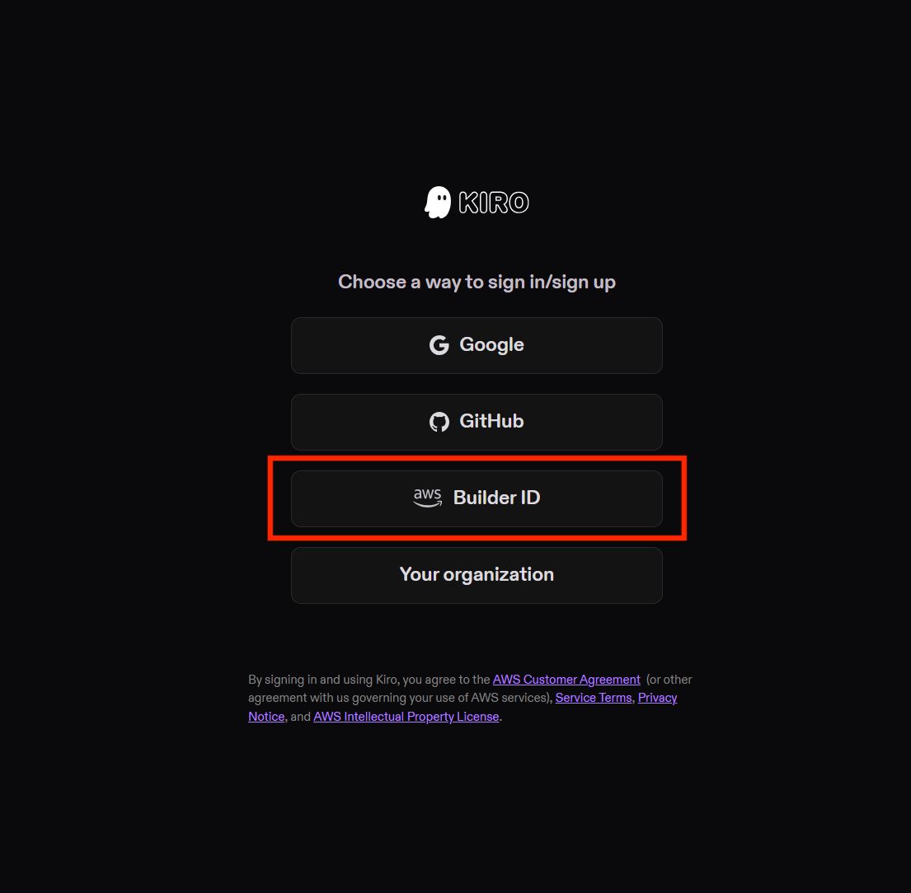
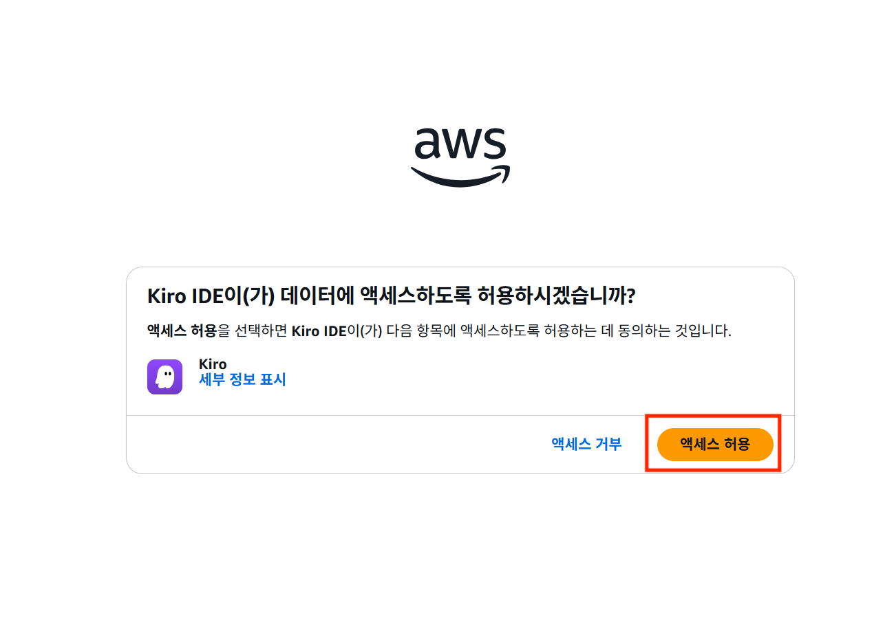

# Part 2. Hands-on: Kiro로 FinOps Agent 개발하기 (80분)

## 2-1. 환경 설정 (15분)

### Kiro 설치

1. [https://kiro.dev](https://kiro.dev)에서 Kiro 다운로드 및 설치

2. Kiro 실행 후 로그인 (AWS Builder ID 또는 IAM Identity Center)






### AWS 자격 증명 구성

FinOps Agent가 AWS Cost Explorer API를 호출하려면 적절한 권한이 필요합니다.

필요한 IAM 권한:

```json
{
  "Version": "2012-10-17",
  "Statement": [
    {
      "Effect": "Allow",
      "Action": [
        "ce:GetCostAndUsage",
        "ce:GetCostForecast",
        "ce:GetReservationUtilization",
        "ce:GetSavingsPlansUtilization",
        "ec2:DescribeInstances",
        "ec2:DescribeInstanceStatus",
        "cloudwatch:GetMetricData"
      ],
      "Resource": "*"
    }
  ]
}
```

> 워크샵 환경에서는 사전에 구성된 IAM 역할을 사용합니다.

### 프로젝트 초기화

1. Kiro에서 새 프로젝트 생성
2. 프로젝트 이름: `finops-agent`
3. 기본 프로젝트 구조 확인

```
finops-agent/
├── .kiro/
│   └── specs/              # Kiro Spec 파일들이 저장되는 위치
├── src/
│   ├── agent.py            # Agent 메인 로직
│   ├── tools.py            # FinOps Tool 함수들
│   └── app.py              # Streamlit 챗 UI
├── requirements.txt
└── README.md
```

---

## 2-2. Spec 작성으로 Agent 설계하기 (25분)

Kiro의 핵심은 **Spec-Driven Development**입니다. 프롬프트 한 줄로 코딩을 시작하는 것이 아니라, 구조화된 Spec을 먼저 만들고 이를 기반으로 구현합니다.

### Step 1: Requirement 생성

Kiro에서 **New Spec**을 시작하고, 다음 프롬프트를 입력합니다:

```
AWS FinOps Agent를 만들고 싶습니다.

[백엔드 - Agent]
- Strands Agents SDK 기반의 AI Agent
- AWS Cost Explorer API를 호출하여 비용 데이터를 조회·분석
- 자연어 질문을 이해하고, 적절한 Tool을 선택하여 답변
- 주요 기능:
  1. 서비스별 비용 조회 (기간 지정 가능)
  2. 월별 비용 추세 분석 및 전월 대비 비교
  3. 비용 이상 징후 자동 탐지 (임계값 기반)
  4. 비용 최적화 추천 (Savings Plans, 인스턴스 적정화 등)

[프론트엔드 - 챗 UI]
- Streamlit 기반 웹 채팅 인터페이스
- 사용자가 자연어로 질문하면 Agent가 응답
- 대화 히스토리 유지
- 비용 데이터를 표와 차트로 시각화

[기술 스택]
- Python 3.12, Strands Agents SDK, Boto3
- UI: Streamlit
- LLM: Amazon Bedrock (Claude Sonnet)
```

Kiro가 생성하는 **Requirement 문서**를 확인합니다:

#### 예상되는 Requirement 구조

```markdown
# FinOps Agent Requirements

## User Stories

### US-1: 서비스별 비용 조회
As a cloud operator,
I want to query AWS costs by service for a specific date range,
So that I can understand where my cloud spending is going.

**Acceptance Criteria:**
- GIVEN a start date and end date
  WHEN the user asks for cost breakdown
  THEN the agent returns a list of services sorted by cost (descending)
  AND each entry includes service name, cost amount, and currency unit

### US-2: 비용 추세 분석
As a finance manager,
I want to see monthly cost trends and month-over-month comparison,
So that I can identify spending patterns and forecast future costs.

**Acceptance Criteria:**
- GIVEN a time range of at least 2 months
  WHEN the user asks for cost trends
  THEN the agent returns monthly costs with change amount and percentage
  AND highlights months with significant increases (>10%)

### US-3: 비용 이상 탐지
As a cloud operator,
I want the agent to detect abnormal cost increases automatically,
So that I can respond quickly to unexpected spending spikes.

**Acceptance Criteria:**
- GIVEN a configurable threshold (default 20%)
  WHEN the user requests anomaly detection
  THEN the agent compares current vs previous period costs per service
  AND flags services exceeding the threshold
  AND sorts results by severity (highest change first)

### US-4: 비용 최적화 추천
As a cloud architect,
I want to receive actionable cost optimization recommendations,
So that I can reduce unnecessary cloud spending.

**Acceptance Criteria:**
- GIVEN current usage data from Cost Explorer
  WHEN the user asks for optimization tips
  THEN the agent analyzes underutilized resources
  AND suggests specific actions (rightsizing, Savings Plans, etc.)
  AND includes estimated monthly savings for each recommendation

### US-5: 채팅 UI
As an end user,
I want a web-based chat interface to interact with the FinOps agent,
So that I can ask questions in natural language without using CLI.

**Acceptance Criteria:**
- GIVEN the Streamlit app is running
  WHEN the user types a question and submits
  THEN the agent's response is displayed in a chat bubble format
  AND conversation history is preserved within the session
  AND cost data is rendered as tables or charts when appropriate
```

확인 포인트:
- 각 User Story가 명확한 역할(As a), 목적(So that)을 가지고 있는지
- Acceptance Criteria의 GIVEN-WHEN-THEN이 테스트 가능한지
- 누락된 요구사항이 없는지 (필요 시 수정 요청)

### Step 2: Design 확인

Requirement를 승인하면, Kiro가 **Design 문서**를 자동 생성합니다.

#### 예상되는 Design 구조

**아키텍처 다이어그램:**

```
┌─────────────────────────────────────────────┐
│              Streamlit Chat UI               │
│  ┌─────────┐  ┌──────────┐  ┌────────────┐  │
│  │ Chat    │  │ Data     │  │ Chart      │  │
│  │ Input   │  │ Table    │  │ Rendering  │  │
│  └────┬────┘  └──────────┘  └────────────┘  │
│       │                                      │
└───────┼──────────────────────────────────────┘
        │ invoke
        ▼
┌─────────────────────────────────────────────┐
│           Strands Agent (Claude Sonnet)       │
│                                               │
│  System Prompt: FinOps 전문가 역할 정의         │
│  Tool Selection → Execution → Response         │
└───────┬───────────┬──────────┬───────────────┘
        │           │          │
        ▼           ▼          ▼
┌────────────┐ ┌─────────┐ ┌──────────────┐
│ get_cost   │ │ detect  │ │ get_optim    │
│ _by_service│ │ _anomaly│ │ _tips        │
├────────────┤ ├─────────┤ ├──────────────┤
│ get_cost   │ │         │ │              │
│ _trend     │ │         │ │              │
└─────┬──────┘ └────┬────┘ └──────┬───────┘
      │             │             │
      ▼             ▼             ▼
┌─────────────────────────────────────────────┐
│           AWS Cost Explorer API               │
└─────────────────────────────────────────────┘
```

**Tool 상세 정의:**

| Tool | 함수명 | 파라미터 | 반환값 | AWS API |
|------|--------|---------|--------|---------|
| 서비스별 비용 | `get_cost_by_service` | `start_date: str`, `end_date: str` | `{services: [{service, cost, unit}], period}` | `ce:GetCostAndUsage` |
| 비용 추세 | `get_cost_trend` | `months: int`, `service: Optional[str]` | `{trends: [{month, cost, change, change_pct}]}` | `ce:GetCostAndUsage` |
| 이상 탐지 | `detect_anomaly` | `threshold_percent: float` | `{anomalies: [{service, prev_cost, curr_cost, change_pct}]}` | `ce:GetCostAndUsage` |
| 최적화 추천 | `get_optimization_tips` | `service: Optional[str]` | `{recommendations: [{action, detail, estimated_savings}]}` | `ce:GetCostAndUsage`, `ce:GetSavingsPlansUtilization` |

**UI 설계:**

| 컴포넌트 | 설명 |
|----------|------|
| `st.chat_input` | 사용자 질문 입력 |
| `st.chat_message` | Agent/사용자 메시지 표시 (role별 아바타 구분) |
| `st.dataframe` | 비용 데이터 테이블 렌더링 |
| `st.bar_chart` | 서비스별 비용 비교 차트 |
| `st.line_chart` | 월별 비용 추세 차트 |
| `st.sidebar` | 설정 패널 (기간 선택, 임계값 조정) |

### Step 3: Task 확인

Design으로부터 Kiro가 구현 **Task 목록**을 생성합니다.

예상 태스크:

- [ ] Task 1: 프로젝트 초기 구조 및 의존성 설정 (`requirements.txt`, 디렉토리 구조)
- [ ] Task 2: AWS Cost Explorer 클라이언트 헬퍼 구현 (`src/tools.py` - 공통 boto3 클라이언트)
- [ ] Task 3: `get_cost_by_service` Tool 구현
- [ ] Task 4: `get_cost_trend` Tool 구현
- [ ] Task 5: `detect_anomaly` Tool 구현
- [ ] Task 6: `get_optimization_tips` Tool 구현
- [ ] Task 7: Agent 메인 로직 구현 (`src/agent.py` - Strands Agent, system prompt, tool 바인딩)
- [ ] Task 8: Streamlit 챗 UI 구현 (`src/app.py` - 채팅 인터페이스, 데이터 시각화)
- [ ] Task 9: 로컬 테스트 및 검증

---

## 2-3. Kiro와 함께 Agent 코드 구현 (40분)

### Task별 구현 진행

Kiro의 Task 목록에서 각 태스크를 클릭하면, Kiro가 해당 태스크에 맞는 코드를 자동 구현합니다. 생성된 코드를 리뷰하고, 필요 시 수정을 요청합니다.

### 주요 구현 코드 살펴보기

#### Tool 구현: 서비스별 비용 조회

```python
# src/tools.py
import boto3
from datetime import datetime, timedelta
from typing import Optional

ce_client = boto3.client('ce')

def get_cost_by_service(start_date: str, end_date: str) -> dict:
    """특정 기간의 AWS 서비스별 비용을 조회합니다.
    
    Args:
        start_date: 조회 시작일 (YYYY-MM-DD)
        end_date: 조회 종료일 (YYYY-MM-DD)
    
    Returns:
        서비스별 비용 목록
    """
    response = ce_client.get_cost_and_usage(
        TimePeriod={'Start': start_date, 'End': end_date},
        Granularity='MONTHLY',
        Metrics=['UnblendedCost'],
        GroupBy=[{'Type': 'DIMENSION', 'Key': 'SERVICE'}]
    )
    
    results = []
    for time_period in response['ResultsByTime']:
        for group in time_period['Groups']:
            service_name = group['Keys'][0]
            amount = float(group['Metrics']['UnblendedCost']['Amount'])
            if amount > 0:
                results.append({
                    'service': service_name,
                    'cost': round(amount, 2),
                    'unit': group['Metrics']['UnblendedCost']['Unit']
                })
    
    results.sort(key=lambda x: x['cost'], reverse=True)
    return {'services': results, 'period': f"{start_date} ~ {end_date}"}
```

#### Tool 구현: 비용 추세 분석

```python
def get_cost_trend(months: int = 3, service: Optional[str] = None) -> dict:
    """최근 N개월간의 비용 추세를 분석합니다.
    
    Args:
        months: 조회할 개월 수 (기본 3개월)
        service: 특정 서비스만 필터링 (선택)
    
    Returns:
        월별 비용 추이 및 변화율
    """
    today = datetime.now()
    start = (today.replace(day=1) - timedelta(days=30 * months)).replace(day=1)
    
    group_by = [{'Type': 'DIMENSION', 'Key': 'SERVICE'}]
    filter_expr = None
    if service:
        filter_expr = {'Dimensions': {'Key': 'SERVICE', 'Values': [service]}}
    
    params = {
        'TimePeriod': {
            'Start': start.strftime('%Y-%m-%d'),
            'End': today.strftime('%Y-%m-%d')
        },
        'Granularity': 'MONTHLY',
        'Metrics': ['UnblendedCost'],
        'GroupBy': group_by
    }
    if filter_expr:
        params['Filter'] = filter_expr
    
    response = ce_client.get_cost_and_usage(**params)
    
    trends = []
    prev_total = None
    for period in response['ResultsByTime']:
        month = period['TimePeriod']['Start'][:7]
        total = sum(
            float(g['Metrics']['UnblendedCost']['Amount'])
            for g in period['Groups']
        )
        change = round(total - prev_total, 2) if prev_total is not None else 0
        change_pct = round((change / prev_total) * 100, 1) if prev_total and prev_total > 0 else 0
        trends.append({
            'month': month,
            'cost': round(total, 2),
            'change': change,
            'change_percent': change_pct
        })
        prev_total = total
    
    return {'trends': trends, 'months': months, 'service_filter': service}
```

#### Tool 구현: 비용 이상 탐지

```python
def detect_anomaly(threshold_percent: float = 20.0) -> dict:
    """전월 대비 비용이 급증한 서비스를 탐지합니다.
    
    Args:
        threshold_percent: 이상 판단 임계값 (%, 기본 20%)
    
    Returns:
        이상 탐지 결과 목록
    """
    today = datetime.now()
    current_month_start = today.replace(day=1).strftime('%Y-%m-%d')
    last_month_start = (today.replace(day=1) - timedelta(days=1)).replace(day=1).strftime('%Y-%m-%d')
    last_month_end = today.replace(day=1).strftime('%Y-%m-%d')
    
    previous = get_cost_by_service(last_month_start, last_month_end)
    current = get_cost_by_service(current_month_start, today.strftime('%Y-%m-%d'))
    
    prev_map = {s['service']: s['cost'] for s in previous['services']}
    
    anomalies = []
    for service in current['services']:
        name = service['service']
        curr_cost = service['cost']
        prev_cost = prev_map.get(name, 0)
        
        if prev_cost > 0:
            change_pct = ((curr_cost - prev_cost) / prev_cost) * 100
            if change_pct > threshold_percent:
                anomalies.append({
                    'service': name,
                    'previous_cost': prev_cost,
                    'current_cost': curr_cost,
                    'change_percent': round(change_pct, 1)
                })
    
    anomalies.sort(key=lambda x: x['change_percent'], reverse=True)
    return {'anomalies': anomalies, 'threshold': threshold_percent}
```

#### Agent 메인 로직

```python
# src/agent.py
from strands import Agent
from tools import get_cost_by_service, get_cost_trend, detect_anomaly, get_optimization_tips

SYSTEM_PROMPT = """당신은 AWS FinOps 전문가 Agent입니다.

## 역할
사용자의 AWS 클라우드 비용 관련 질문에 데이터 기반으로 답변하고, 비용 최적화를 도와줍니다.

## 답변 원칙
- 항상 Tool을 호출하여 실제 데이터를 조회한 후 답변하세요.
- 비용은 USD 기준으로, 소수점 둘째 자리까지 표시하세요.
- 비용 변화를 설명할 때는 금액과 변화율(%)을 함께 제시하세요.
- 최적화 추천 시에는 구체적인 액션과 예상 절감액을 포함하세요.
- 데이터가 없거나 불확실한 경우 추측하지 말고 솔직히 안내하세요.

## 답변 형식
- 비용 목록은 표 형태로 정리하세요.
- 추세 데이터는 월별로 나열하세요.
- 이상 징후는 심각도 순으로 정렬하세요.
"""

def create_agent():
    return Agent(
        model="us.anthropic.claude-sonnet-4-6-v1",
        system_prompt=SYSTEM_PROMPT,
        tools=[get_cost_by_service, get_cost_trend, detect_anomaly, get_optimization_tips]
    )
```

#### Streamlit 챗 UI

```python
# src/app.py
import streamlit as st
from agent import create_agent

st.set_page_config(page_title="AWS FinOps Agent", page_icon="💰", layout="wide")
st.title("AWS FinOps Agent")
st.caption("자연어로 AWS 비용을 분석하고 최적화 추천을 받아보세요.")

# 사이드바 설정
with st.sidebar:
    st.header("설정")
    anomaly_threshold = st.slider("이상 탐지 임계값 (%)", 5, 50, 20)
    st.divider()
    st.markdown("**예시 질문:**")
    st.markdown("- 지난 달 서비스별 비용을 보여줘")
    st.markdown("- EC2 비용 추세를 분석해줘")
    st.markdown("- 비용 이상 징후가 있어?")
    st.markdown("- 비용 절감 방법을 추천해줘")

# 세션 상태 초기화
if "messages" not in st.session_state:
    st.session_state.messages = []
if "agent" not in st.session_state:
    st.session_state.agent = create_agent()

# 대화 히스토리 표시
for message in st.session_state.messages:
    with st.chat_message(message["role"]):
        st.markdown(message["content"])

# 사용자 입력 처리
if prompt := st.chat_input("AWS 비용에 대해 질문해보세요..."):
    st.session_state.messages.append({"role": "user", "content": prompt})
    with st.chat_message("user"):
        st.markdown(prompt)
    
    with st.chat_message("assistant"):
        with st.spinner("분석 중..."):
            response = st.session_state.agent(prompt)
            answer = str(response)
        st.markdown(answer)
    
    st.session_state.messages.append({"role": "assistant", "content": answer})
```

### 로컬 테스트

#### Agent 테스트 (CLI)

```bash
cd finops-agent
pip install -r requirements.txt
python -c "from src.agent import create_agent; agent = create_agent(); print(agent('이번 달 비용을 서비스별로 보여줘'))"
```

#### UI 테스트 (브라우저)

```bash
streamlit run src/app.py
```

브라우저에서 `http://localhost:8501`로 접속하여 다음을 테스트합니다:

| 테스트 항목 | 질문 예시 | 확인 포인트 |
|------------|----------|------------|
| 기본 비용 조회 | "지난 달 AWS 비용을 서비스별로 보여줘" | 서비스별 비용이 표 형태로 표시되는지 |
| 추세 분석 | "EC2 비용이 최근 3개월간 어떻게 변했어?" | 월별 변화와 증감율이 포함되는지 |
| 이상 탐지 | "비용이 비정상적으로 증가한 서비스가 있어?" | 임계값 초과 서비스가 심각도 순으로 표시되는지 |
| 최적화 추천 | "비용을 줄일 수 있는 방법을 추천해줘" | 구체적 액션과 예상 절감액이 포함되는지 |
| 멀티 턴 대화 | "그 중에서 가장 많이 쓴 서비스는?" | 이전 대화 컨텍스트를 기억하는지 |

---

> **다음 단계**: [Part 3. Bedrock AgentCore에 배포하기](part3-deploy.md)
