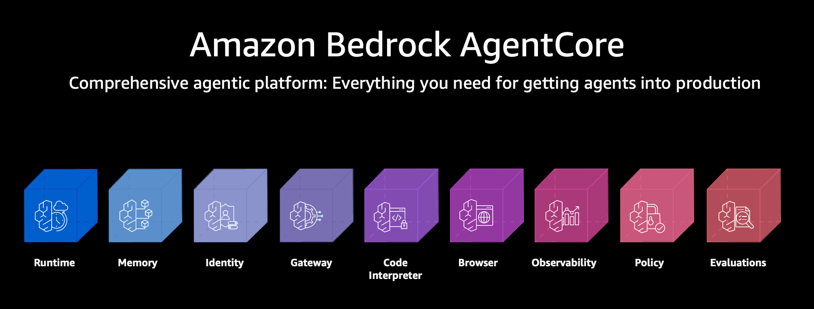
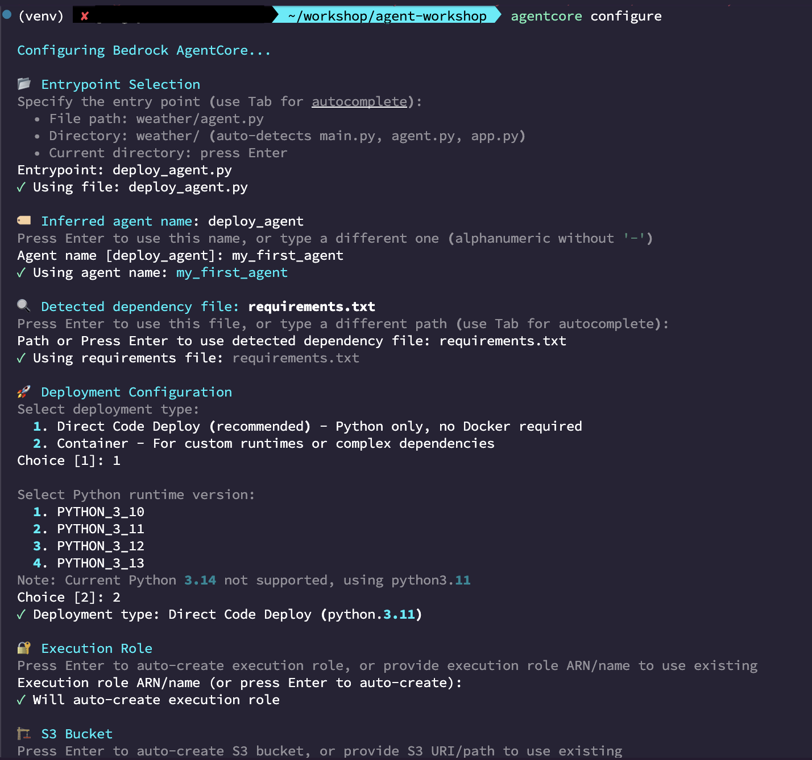
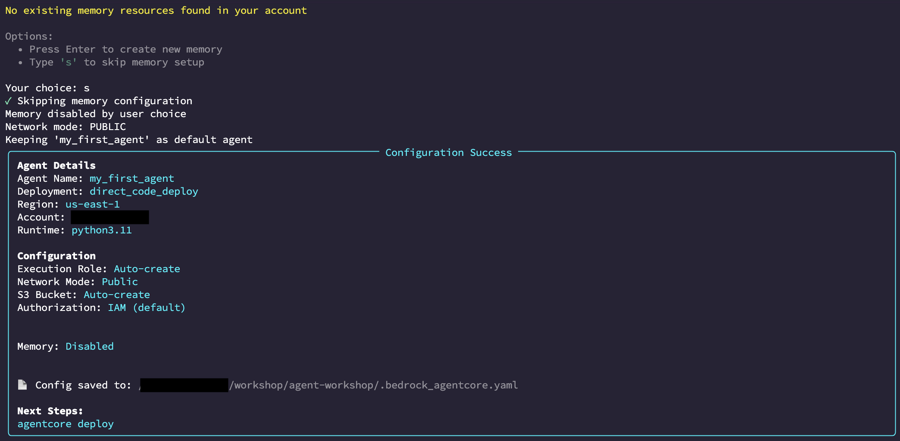
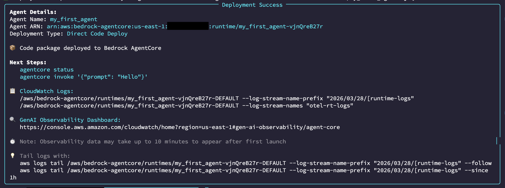
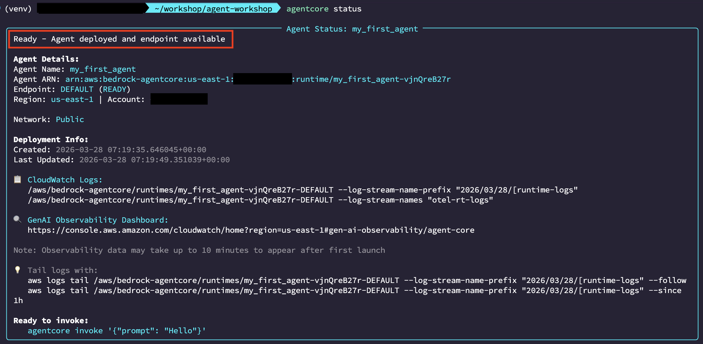
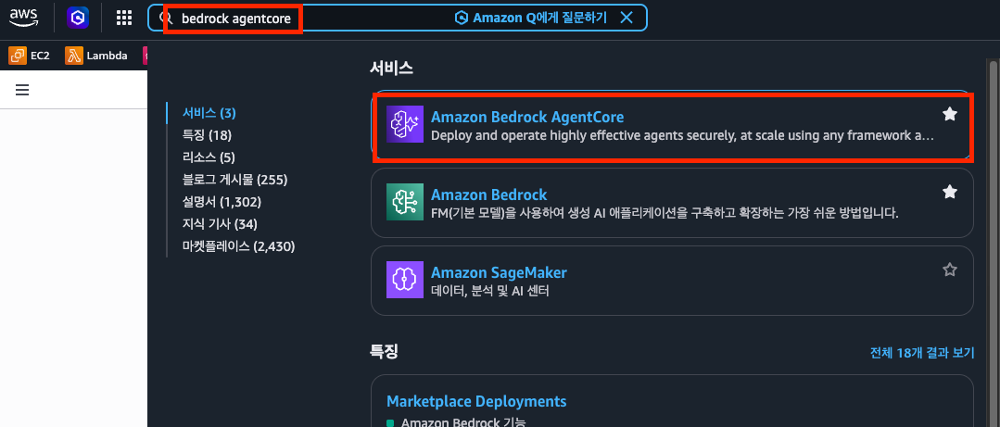
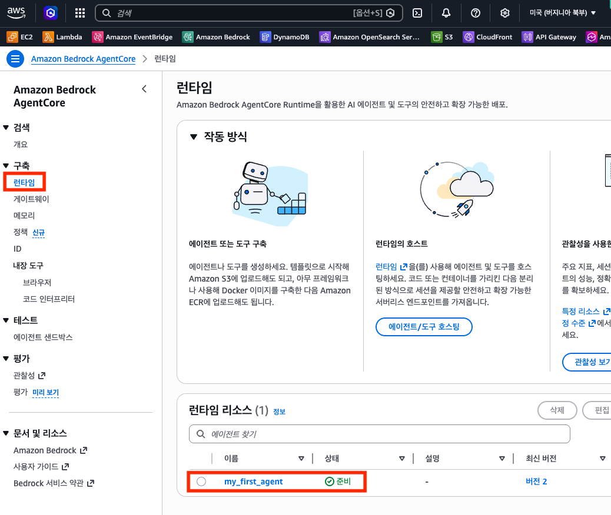

# Part 3. Hands-on: Bedrock AgentCore에 배포하기 (50분)

## 3-1. AgentCore 배포 준비 (15분)

### Agent Runtime 설정


AgentCore에 Agent를 배포하려면 런타임 환경을 정의해야 합니다.

#### 런타임 구성 파일 작성

```yaml
# agentcore-config.yaml
runtime:
  name: finops-agent-runtime
  description: "AWS FinOps Agent for cost analysis and optimization"
  entry_point: "agent.main"
  environment:
    python_version: "3.12"
```

#### 의존성 정의

```txt
# requirements.txt
strands-agents
boto3>=1.35.0
```

### IAM 역할 구성

Agent가 AWS 서비스에 접근하기 위한 IAM 역할을 설정합니다.

#### Agent 실행 역할 (Trust Policy)

```json
{
  "Version": "2012-10-17",
  "Statement": [
    {
      "Effect": "Allow",
      "Principal": {
        "Service": "agentcore.bedrock.amazonaws.com"
      },
      "Action": "sts:AssumeRole"
    }
  ]
}
```

#### Agent 권한 (Permission Policy)

```json
{
  "Version": "2012-10-17",
  "Statement": [
    {
      "Effect": "Allow",
      "Action": [
        "ce:GetCostAndUsage",
        "ce:GetCostForecast",
        "ce:GetReservationUtilization",
        "ce:GetSavingsPlansUtilization",
        "ec2:DescribeInstances",
        "cloudwatch:GetMetricData"
      ],
      "Resource": "*"
    }
  ]
}
```

> AgentCore가 Agent에 IAM 역할을 자동으로 부여하므로, Agent 코드에 AWS 자격 증명을 하드코딩할 필요가 없습니다.

### Tool 연결

AgentCore에서 Tool을 등록하고 Agent에 연결합니다.

```bash
# AgentCore CLI를 통한 Tool 등록 예시
aws bedrock-agentcore create-tool \
  --tool-name get-cost-by-service \
  --description "서비스별 AWS 비용 조회" \
  --schema file://tools/get_cost_by_service.json
```

---

## 3-2. Agent 배포 및 테스트 (25분)

### AgentCore에 배포

#### Step 1: Agent 등록

```bash
# Agent를 AgentCore에 등록
aws bedrock-agentcore create-agent-runtime \
  --agent-runtime-name finops-agent \
  --description "AWS FinOps cost analysis agent" \
  --role-arn arn:aws:iam::ACCOUNT_ID:role/finops-agent-role
```



#### Step 2: 코드 패키징 및 배포

```bash
# Agent 코드 패키징
zip -r finops-agent.zip src/ requirements.txt agentcore-config.yaml

# AgentCore에 배포
aws bedrock-agentcore deploy-agent-runtime \
  --agent-runtime-name finops-agent \
  --code-source file://finops-agent.zip
```


#### Step 3: 배포 상태 확인

```bash
# 배포 상태 확인
aws bedrock-agentcore get-agent-runtime \
  --agent-runtime-name finops-agent
```



배포 상태가 `ACTIVE`가 되면 Agent를 사용할 수 있습니다.

### 배포된 Agent 테스트

#### API를 통한 호출

```bash
# Agent에 메시지 보내기
aws bedrock-agentcore invoke-agent-runtime \
  --agent-runtime-name finops-agent \
  --session-id "test-session-001" \
  --input-text "지난 달 비용이 가장 많이 나온 서비스 Top 5를 알려줘"
```

#### 테스트 시나리오

다음 시나리오를 순서대로 테스트합니다:

**시나리오 1: 기본 비용 조회**

```
"이번 달 AWS 비용을 서비스별로 보여줘"
```

확인 포인트:
- Cost Explorer API가 정상 호출되는지
- 서비스별 비용이 정렬되어 반환되는지
- 금액 단위(USD)가 올바른지

**시나리오 2: 비용 추세 분석**

```
"최근 3개월간 EC2 비용 추이를 분석해줘"
```

확인 포인트:
- 월별 데이터가 정확한지
- 증감 추세를 올바르게 설명하는지

**시나리오 3: 이상 탐지**

```
"비용이 비정상적으로 증가한 서비스가 있는지 확인해줘"
```

확인 포인트:
- 전월 대비 급증한 서비스를 감지하는지
- 증가율과 금액을 함께 보여주는지

**시나리오 4: 최적화 추천**

```
"비용을 줄일 수 있는 방법을 추천해줘"
```

확인 포인트:
- 실제 사용 데이터 기반의 추천인지
- 예상 절감액이 포함되어 있는지

**시나리오 5: 복합 질의 (멀티 턴)**

```
"지난 달 비용을 보여줘"
→ "그 중에서 가장 많이 증가한 서비스는?"
→ "그 서비스의 비용을 줄이려면 어떻게 해야 해?"
```

확인 포인트:
- 이전 대화 컨텍스트를 유지하는지
- 여러 Tool을 조합하여 답변하는지

---

## 3-3. 운영 모니터링 (10분)

### Observability 확인

AgentCore는 Agent의 실행 과정을 자동으로 기록합니다.

#### 실행 로그 확인

```bash
# 최근 실행 로그 조회
aws bedrock-agentcore list-agent-runtime-invocations \
  --agent-runtime-name finops-agent \
  --max-results 10
```

#### 트레이스 확인

각 Agent 호출의 상세 실행 과정을 트레이스로 확인할 수 있습니다:

```
사용자 입력
  → LLM 추론 (Tool 선택)
    → Tool 호출: get_cost_by_service
      → AWS Cost Explorer API 호출
    ← Tool 응답
  → LLM 추론 (답변 생성)
← Agent 응답
```

확인할 수 있는 정보:

| 항목 | 설명 |
|------|------|
| 총 실행 시간 | 요청부터 응답까지 소요 시간 |
| LLM 호출 횟수 | Agent가 LLM을 몇 번 호출했는지 |
| Tool 호출 내역 | 어떤 Tool을 어떤 순서로 호출했는지 |
| Token 사용량 | 입력/출력 토큰 수 |
| 에러 여부 | 실행 중 발생한 오류 |

#### CloudWatch 연동

AgentCore는 CloudWatch에 자동으로 메트릭을 전송합니다:

- `InvocationCount`: Agent 호출 횟수
- `InvocationLatency`: 응답 지연 시간
- `ErrorRate`: 오류 발생률
- `TokenUsage`: 토큰 사용량

이를 통해 대시보드를 구성하거나 알람을 설정할 수 있습니다.

---

> **다음 단계**: [Part 4. Wrap-up](part4-wrapup.md)
